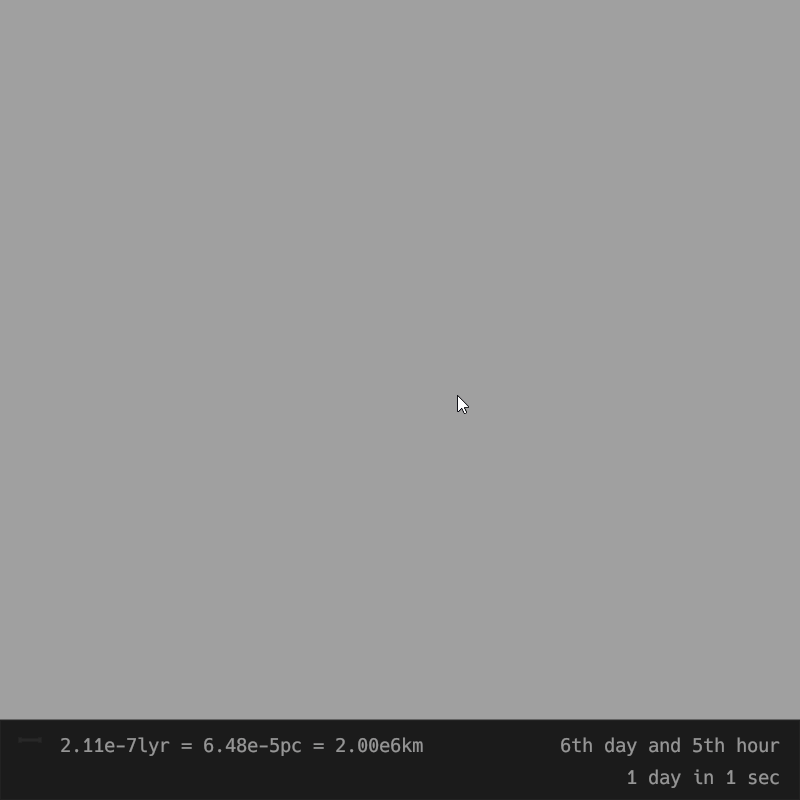

# Celestial
An app that simulates gravity using Newton's law of universal gravitation.

## Demo

## App Overview
The app displays objects in the workspace, and the scale, elapsed time, and simulation speed in the bottom panel.

The app can also show forces, velocities, accelerations, and impulses of the objects — press `F`, `V`, `A`, or `I` respectively. The scale for these values will also appear in the bottom panel.

## Controls
- **Zoom:** mouse wheel
- **Pan across the workspace:** drag with the left mouse button
- **Increase/decrease simulation speed:** `Alt` + mouse wheel
- **Show physics vectors:** press `F`, `V`, `A`, or `I` to view force, velocity, acceleration, or impulse of objects respectively
- **Hide physics vectors:** `Escape`
- **Spawn a new object:** press and hold the `left mouse button` at the desired spawn point, then drag to set its initial velocity. Adjust the object's mass using the `mouse wheel` before releasing.
